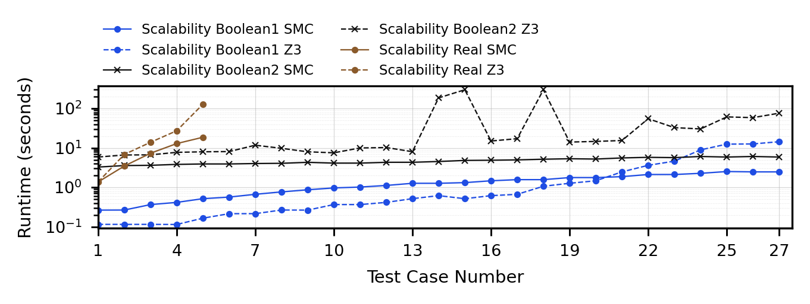

# SMC

SMC is a C++17 command-line solver for SMT-LIB benchmark files. The repository
also includes small test formulas in `data/test` and larger SatEX benchmarks in
`data/SatEX`.

## Requirements

Install the following dependencies before building:

- CMake 3.5 or newer
- A C++17 compiler such as `g++` or `clang++`
- Gurobi, including a valid local license
- OpenCV
- LibTorch, expected at `tool/libtorch`
- Z3 C++ libraries and headers
- Zlib
- Readline

Set up the main external dependencies as follows.

Install the C++ distribution of LibTorch from the PyTorch website, then place
or extract it under `tool/` so this path exists:

```text
tool/libtorch
```

Install Gurobi and configure `GUROBI_HOME` for your shell. For example:

```bash
echo 'export GUROBI_HOME=/path/to/gurobi' >> ~/.bashrc
source ~/.bashrc
```

Install Z3 and configure `Z3_HOME` for your shell. For example:

```bash
echo 'export Z3_HOME=/path/to/z3' >> ~/.bashrc
source ~/.bashrc
```

Install Readline through your system package manager. On Ubuntu or Debian:

```bash
sudo apt-get update
sudo apt-get install libreadline-dev
```

The build uses the CMake finder files in `cmake/` for Gurobi and Z3. If CMake
cannot find a dependency, set the relevant environment variables or CMake
variables for your local installation before running `cmake`.

## Build

From the repository root:

```bash
mkdir -p build
cmake -S . -B build
cmake --build build
```

The SMC executable is written to:

```text
bin/SMC
```

You can verify that the binary is available with:

```bash
./bin/SMC --help
```

Expected usage:

```text
Usage: Verification [options] input
```

## Example Test Cases

The repository includes five small SMT-LIB examples:

```text
data/test/formula_1.smt  sat
data/test/formula_2.smt  unsat
data/test/formula_3.smt  sat
data/test/formula_4.smt  unsat
data/test/formula_5.smt  sat
```

Run one example with SMC:

```bash
./bin/SMC data/test/formula_1.smt
```

You can also compare the result with Z3:

```bash
z3 data/test/formula_1.smt
```

## SatEX Experiment

To compare SMC and Z3 on every `.smt2` benchmark under `data/SatEX`, use the
included Python experiment script:

```bash
./compare_satex_smc_z3.py
```

The default CSV output is:

```text
results/satex_smc_z3_results.csv
```

Each row records the solver, benchmark path, run number, solver status, parsed
`sat`/`unsat`/`unknown` result, elapsed time, return code, timeout flag, and
captured output.

To generate the runtime comparison plot from the CSV:

```bash
./plot_satex_smc_vs_z3.py
```

The default plot output is:

```text
results/satex_smc_vs_z3.png
```



